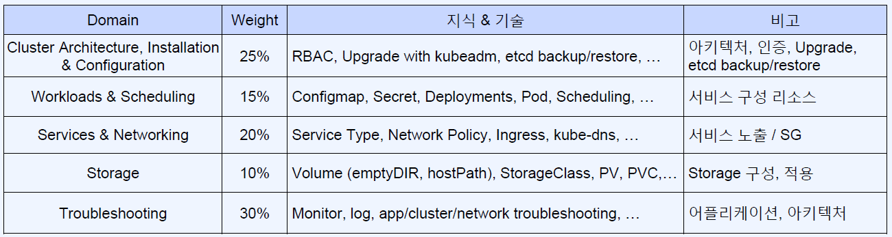

# 쿠버네티스 자격증 종류

* Cloud Native Associate  
객관식 시험. k8s 환경에 대한 기본적인 이해를 점검.  
ctl 명령어를 통한 컨테이너, 파드, 노드, 클러스터와 같은 요소와 네트워크 등의 환경 기반 지식을 확인.
* Certified Kubernetes Administrator (CKA)  
쿠버네티스 관리자 역량 점검. 운영/트러블슈팅 능력 점검.  
* Certified Kubernetes Application Developer  
쿠버네티스 환경에서 어플리케이션을 배포하고 운영하는 지식 점검.
* Certified Kubernetes Security Specialist  
쿠버네티스 환경에서 보안적 관점과 흐름에 대한 지식 점검.  
CKA 자격 보유자만 응시 가능.
* Certified Kubernetes Service Provider  
회사 단위 자격.  
쿠버네티스 지원 컨설팅과 같은 서비스 역량을 보유하고 있는 기업에 부여되는 파트너 인증 제도.  

# Certified Kubernetes Administrator (CKA)

쿠버네티스 관리자의 책임을 수행할 수 있는 기술, 지식 및 역량을 갖추고 있음을 보증

## CKA 출제 유형

  
https://github.com/cncf/curriculum/tree/master 링크 참조!  

## 시험 과정

* 조용한 장소에서 시험 응시 가능
* 예약 후 일정 신청, 일정 24시간 전까지 변경 가능
* Fail 시 한 번 재응시 기회 부여
* CKA 쿠폰이 있으므로 결제 전에 구글링!
* CKA 중국어/일본어도 있으나 한국어는 없어서 영어로 응시 필요
